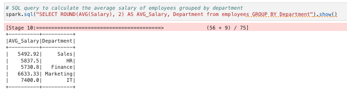

# Big Data Employee Insights Project – IBM Data Engineering Professional Certificate

## Overview

This project demonstrates the use of **Apache Spark** and **PySpark SQL** to load, transform, analyze, and query employee data from a structured CSV file. It was completed as the final project for **Course 12 – Introduction to Big Data with Spark and Hadoop** in the [IBM Data Engineering Professional Certificate](https://www.coursera.org/professional-certificates/ibm-data-engineer).

It simulates a real-world data engineering workflow by covering key concepts such as structured data ingestion, schema enforcement, temporary SQL view creation, column-level transformations, aggregation functions, filtering operations, and join logic — all executed using PySpark’s DataFrame API and SQL interface.

The project is implemented both as a standalone Python script and a Jupyter notebook, allowing for flexibility in running and understanding the Spark-based data pipeline.

---

## Objectives

- Load structured data from CSV into a Spark DataFrame
- Create a temporary SQL view to enable SQL-style queries
- Perform transformations, aggregations, and filtering on employee data
- Add calculated fields (e.g., salary bonus)
- Practice self-joins and grouping operations
- Output and explore various employee-related insights

---

## Tools & Technologies

| Category                   | Tools/Technologies          |
| -------------------------- | --------------------------- |
| **Big Data Engine**        | Apache Spark                |
| **Programming Language**   | Python                      |
| **DataFrame Library**      | PySpark                     |
| **SQL Interface**          | Spark SQL                   |
| **Development Environment**| Jupyter Notebook, VS Code   |

---

## Core Components

### employee_setup_and_transformations.py

This script handles the entire Spark workflow:

- Initializes the Spark session
- Defines a schema for the employee dataset
- Loads data from `employees.csv`
- Creates a temporary SQL view (`employees`)
- Executes SQL and PySpark queries to analyze employee attributes
- Adds a new column (`SalaryAfterBonus`) via transformation
- Outputs results for:
  - Filtering by age
  - Aggregating salaries by department
  - Grouping, joining, and sorting
  - Counting and conditional filters

### FinalProject.ipynb

The notebook version of the project provides an interactive walk-through of all transformation and SQL operations.

---

## Sample Output

Below is a sample output showing the average salary by department using Spark SQL:



---

## Repository Structure

```plaintext
BigData_Employee_Insights_Project/
├── README.md                                  # Project overview, objectives, tools, and usage (this file)
├── data/
│   └── employees.csv                          # Input dataset used for Spark analysis
├── notebook/
│   └── FinalProject.ipynb                     # Jupyter notebook version of the analysis
├── python/
│   └── employee_setup_and_transformations.py  # Complete PySpark script with transformations and queries
├── images/
│   └── sample_output_avg_salary.png           # Output screenshot showing average salary by department
```

---

## How to Run the Script

1. Set up a Python virtual environment (recommended):

   ```bash
   python3 -m venv venv
   source venv/bin/activate
   ```

2. Install the required packages:

   ```bash
   pip install pyspark findspark
   ```

3. Run the PySpark script:

   ```bash
   python python/employee_setup_and_transformations.py
   ```

4. Output will be displayed directly in the terminal.

---

## License

This project was completed as part of the IBM Data Engineering Professional Certificate and is intended for educational use.

---

## Links

- Course Page – [Introduction to Big Data with Spark and Hadoop](https://www.coursera.org/learn/introduction-to-big-data-with-spark-hadoop)
- [GitHub Profile](https://github.com/royungar)
- [GitHub Repository](https://github.com/royungar/BigData_Employee_Insights_Project)